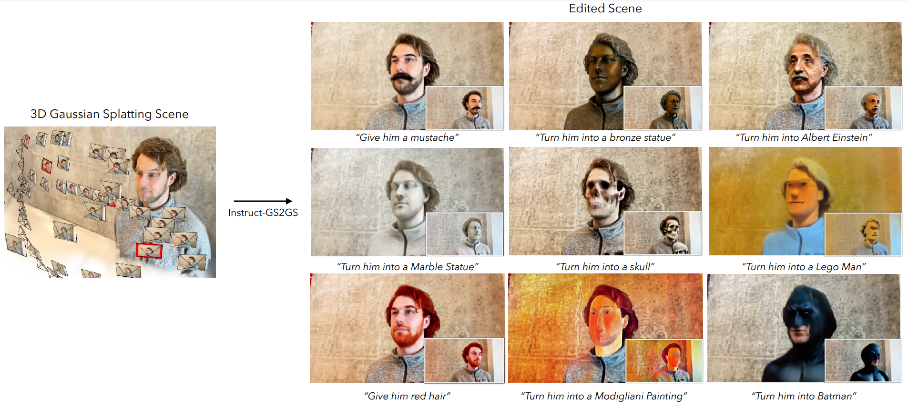

# Instruct-GS2GS: Editing 3D Scenes with Instructions




This codebase is a fork of the original [Instruct-NeRF2NeRF](https://github.com/ayaanzhaque/instruct-nerf2nerf) repository.

# Installation

## 1. Install Nerfstudio dependencies

Instruct-GS2GS is build on Nerfstudio and therefore has the same dependency reqirements. Specfically [PyTorch](https://pytorch.org/) and [tinycudann](https://github.com/NVlabs/tiny-cuda-nn) are required.

Follow the instructions [at this link](https://docs.nerf.studio/quickstart/installation.html) to create the environment and install dependencies. Only follow the commands up to tinycudann. After the dependencies have been installed, return here.

## 2. Installing Instruct-GS2GS

Once you have finished installing dependencies, including those for gsplat, you can install Instruct-GS2GS using the following command:
```bash
pip install git+https://github.com/111550175/AI_Capstone_Final_Project
```

_Optional_: If you would like to work with the code directly, clone then install the repo:
```bash
git clone https://github.com/111550175/AI_Capstone_Final_Project.git
cd instruct-gs2gs
pip install --upgrade pip setuptools
pip install -e .
```

## 3. Checking the install

The following command should include `igs2gs` as one of the options:
```bash
ns-train -h
```

# Using Instruct-GS2GS


To edit a GS, you must first train a regular `splatfacto` scene using your data. To process your custom data, please refer to [this](https://docs.nerf.studio/quickstart/custom_dataset.html) documentation.

Once you have your custom data, you can train your initial GS with the following command:

```bash
ns-train splatfacto --data {PROCESSED_DATA_DIR}
```

For more details on training a GS, see [Nerfstudio documentation](https://docs.nerf.studio/quickstart/first_nerf.html).

Once you have trained your scene for 20k iterations, the checkpoints will be saved to the `outputs` directory. Copy the path to the `nerfstudio_models` folder. (Note: We noticed that training for 20k iterations rather than 30k seemed to run more reliably)

To start training for editing the GS, run the following command:

```bash
ns-train igs2gs --data {PROCESSED_DATA_DIR} --load-dir {outputs/.../nerfstudio_models} --pipeline.prompt {"prompt"} --pipeline.guidance-scale 12.5 --pipeline.image-guidance-scale 1.5
```

The `{PROCESSED_DATA_DIR}` must be the same path as used in training the original GS. Using the CLI commands, you can choose the prompt and the guidance scales used for InstructPix2Pix.

After the GS is trained, you can render the GS using the standard Nerfstudio workflow, found [here](https://docs.nerf.studio/quickstart/viewer_quickstart.html).

## Training Notes

***Important***
Please note that training the GS on images with resolution larger than 512 will likely cause InstructPix2Pix to throw OOM errors. Moreover, it seems InstructPix2Pix performs significantly worse on images at higher resolution. We suggest training with a resolution that is around 512 (max dimension), so add the following tag to the end of both your `splatfacto` and `igs2gs` training command: `nerfstudio-data --downscale-factor {2,4,6,8}` to the end of your `ns-train` commands. Alternatively, you can downscale your dataset yourself and update your `transforms.json` file (scale down w, h, fl_x, fl_y, cx, cy), or you can use a smaller image scale provided by Nerfstudio.

If you have multiple GPUs, training can be sped up by placing InstructPix2Pix on a separate GPU. To do so, add `--pipeline.ip2p-device cuda:{device-number}` to your training command.

| Method | Description | Memory | Quality |
| ---------------------------------------------------------------------------------------------------- | -------------- | ----------------------------------------------------------------- | ----------------------- |
| `igs2gs` | Full model, used in paper | ~15GB | Best |

Currently, we set the max number of iterations for `igs2gs` training to be 7.5k iteratios. Most often, the edit will look good after ~5k iterations. If you would like to train for longer, just reload your last `igs2gs` checkpoint and continue training, or change `--max-num-iterations 10000`.

## Tips

If your edit isn't working as you desire, it is likely because InstructPix2Pix struggles with your images and prompt. We recommend taking one of your training views and trying to edit it in 2D first with InstructPix2Pix, which can be done at [this](https://huggingface.co/spaces/timbrooks/instruct-pix2pix) HuggingFace space. More tips on getting a good edit can be found [here](https://github.com/timothybrooks/instruct-pix2pix#tips).

# Extending Instruct-GS2GS

### Issues
Please open Github issues for any installation/usage problems you run into. We've tried to support as broad a range of GPUs as possible, but it might be necessary to provide even more low-footprint versions. Please contribute with any changes to improve memory usage!

### Code structure
To build off Instruct-GS2GS, we provide explanations of the core code components.

`igs2gs_datamanager.py`: This file is almost identical to the `base_datamanager.py` in Nerfstudio. The main difference is that the entire dataset tensor is pre-computed in the `setup_train` method as opposed to being sampled in the `next_train` method each time.

`igs2gs_pipeline.py`: This file builds on the pipeline module in Nerfstudio. The `get_train_loss_dict` method samples images and places edited images back into the dataset.

`ip2p.py`: This file houses the InstructPix2Pix model (using the `diffusers` implementation). The `edit_image` method is where an image is denoised using the diffusion model, and a variety of helper methods are contained in this file as well.

`igs2gs.py`: We overwrite the `get_loss_dict` method to use LPIPs loss and L1Loss.

## Bibtex
If you use this work or find it helpful, please consider citing: (bibtex)
<pre id="codecell0">@misc{igs2gs,
&nbsp;author = {Vachha, Cyrus and Haque, Ayaan},
&nbsp;title = {Instruct-GS2GS: Editing 3D Gaussian Splats with Instructions},
&nbsp;year = {2024},
&nbsp;url = {https://instruct-gs2gs.github.io/}
} </pre>
